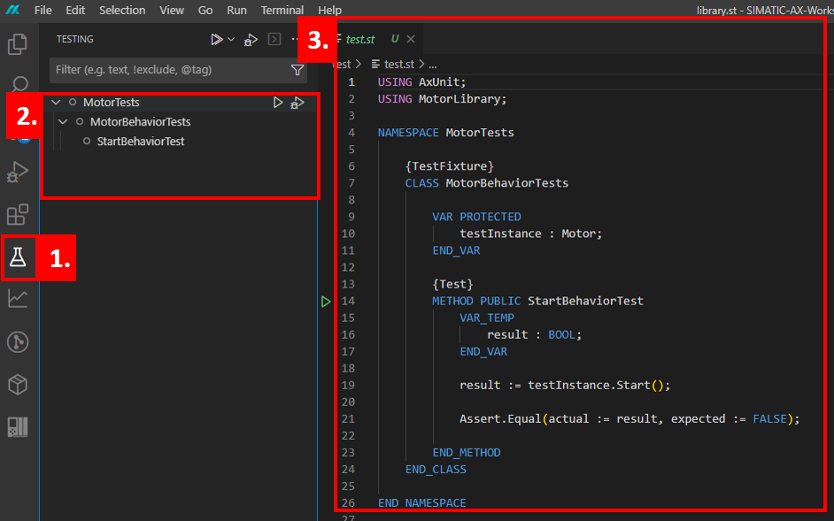
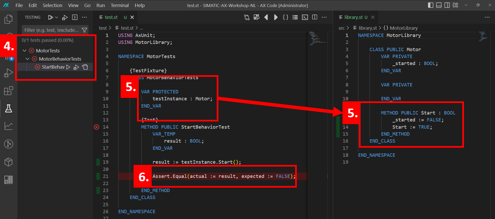

# 2. Usage of the testing framework

## Goal for this training chapter

After this training session:

- you know the test explorer and the `Run tests` button
- you can execute tests within the IDE
- you've knowledge about the command line based testing
- you know, where you find something about test coverage

### :raised_hands: The test explorer and executing tests (hands-on) :raised_hands:

In the tutorial, a single test has been compared to be executed. You can find the predefined test in the `test.st` file in the `test` folder.

1. Open the test explorer
2. Run the tests by clicking on `Run Tests`
3. You will see the test results in the right window



4. Note that the test will **fail!**
5. Open the `library.st` file (located in the `src` folder). The test will call the `motor.start()` function. If we take a look at this function we will see that this function will allways return `TRUE`. However our test case expected `FALSE`.
6. Since it is expected behaviour for the `motor.start()` function to return `TRUE`, change the `expected` value in the test case. And run the test again.




This time the test should have succeeded, indicated by a green checkmark instead of an red cross.

**Alternative workflow**

You can also execute the tests by command line command. You've just to enter `apax test` in a terminal.

```iec-st
apax test
```

> Note: in case of executing the tests by command line, the test explorer results will not be updated. The test results will be shown in the command line output.

### :mortar_board: Test coverage (information) :mortar_board:

If you're interested regarding the test coverage, you'll find information [here](https://console.prod.ax.siemens.cloud/docs/axunit/coverage).

## Summary

Goal reached? Check yourself...

- you know the test explorer and the `Run tests` button ✔
- you can execute tests within the IDE ✔
- you've knowledge about the command line based testing ✔
- you know, where you find something about test coverage

[Continue with next chapter](./3-exportToTia.md)

[Back to overview](./../README.md)
